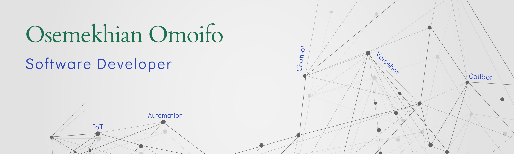

### Hi, I'm Osemekhian 👋

I am passionate about human–machine interaction (HMI) and the use of AI to solve real-world problems.

## Skills and Experience

Programming Languages: C, C++, JavaScript, Kotlin, PHP, Python

- 🔭 I’m currently working on my own startup company.

<!--
**Oseme-sketch/Oseme-sketch** is a ✨ _special_ ✨ repository because its `README.md` (this file) appears on your GitHub profile.

Here are some ideas to get you started:

- 🔭 I’m currently working on ...
- 🌱 I’m currently learning ...
- 👯 I’m looking to collaborate on ...
- 🤔 I’m looking for help with ...
- 💬 Ask me about ...
- 📫 How to reach me: ...
- 😄 Pronouns: ...
- ⚡ Fun fact: ...
-->
